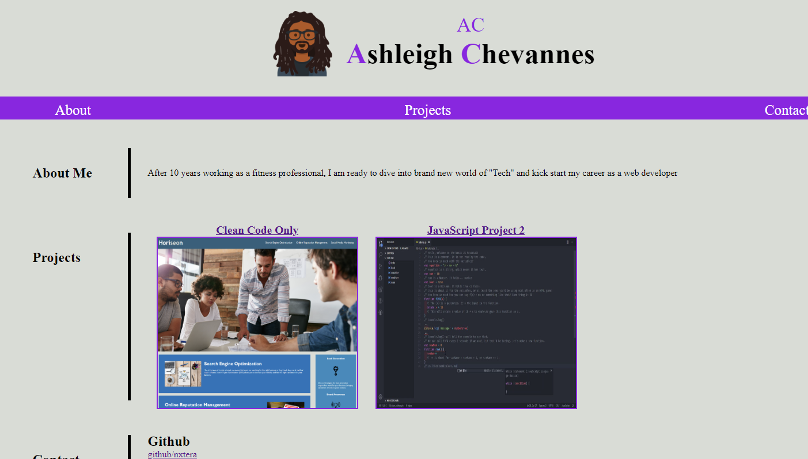

# ACs-Portfolio-is-ACE

## Introducing my first website showcasing my portfolio

### What was my motivation?
I need to showcase what I have learnt and build a website with %100 of my own code.

### What did I do?

Review all the materials from the past 2 weeks of coding bootcamp and try to put it all to use to build my own website to showcase my portfolio. 
	
### What did I learn?

That refactoring code is one thing but having to build your own website from scratch is totally another story. You have to have a clear mind of what you want to create beforehand and a lot of trial and error is involved to get everything working and looking as you wish 

## Usage.

To view the webpage follow the link 
[
(https://nxtera.github.io/ACs-Portfolio-is-ACE/)

Screenshot of live page (sample)

 
   
## Credits
Created readme with help from https://coding-boot-camp.github.io/full-stack/github/professional-readme-guide

## License
Please refer to UNLICENSE.txt
